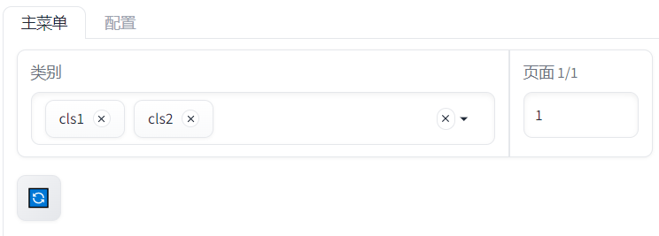
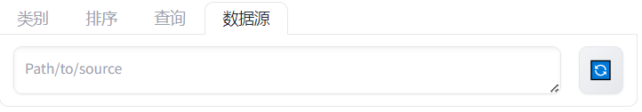
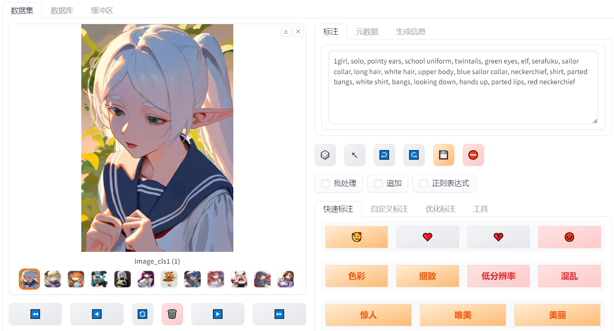
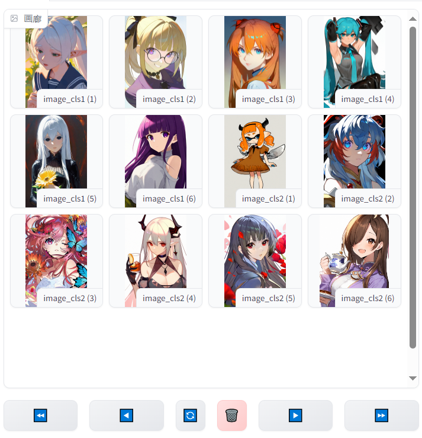
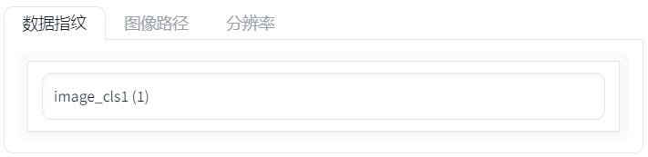
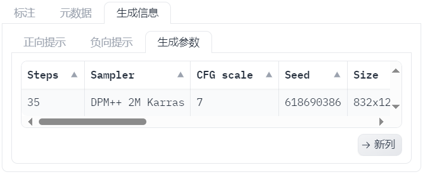
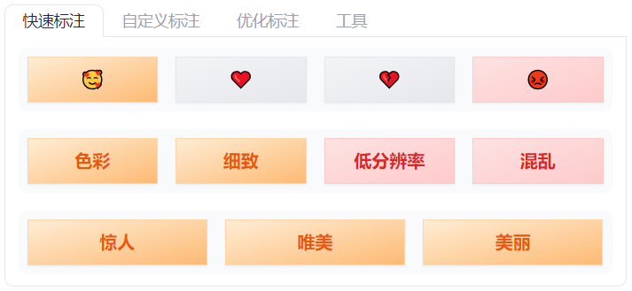
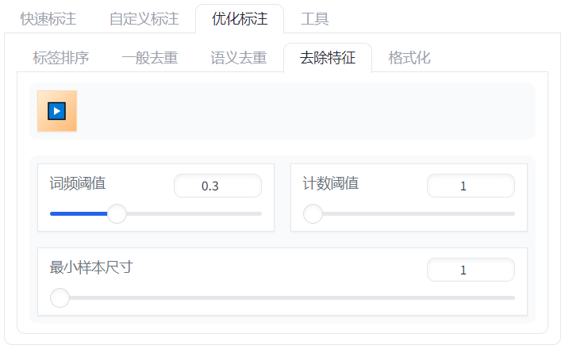
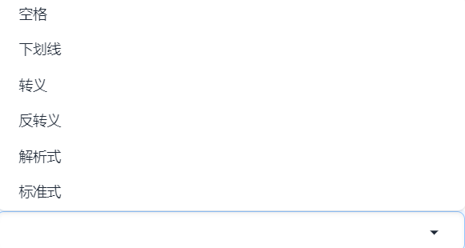

# SD-Dataset-Manager

# 目录

- [1. 介绍](#1-介绍)
  - [更新日志](#更新日志)
- [2. 开始使用](#2-开始使用)
  - [2.1. 安装依赖项](#21-安装依赖项)
  - [2.2. 使用方式一：使用 UI 界面](#22-使用方式一使用-ui-界面)
    - [用法 1](#用法-1)
    - [用法 2](#用法-2)
    - [用法 3](#用法-3)
      - [其他参数](#其他参数)
- [3. 使用方法：UI 界面](#3-使用方法ui-界面)
  - [3.1. 页眉](#31-页眉)
    - [类别选择和定点翻页](#类别选择和定点翻页)
    - [数据排序](#数据排序)
    - [数据搜索](#数据搜索)
    - [更换数据源](#更换数据源)
    - [日志](#日志)
  - [3.2. 数据集处理界面](#32-数据集处理界面)
    - [画廊](#画廊)
    - [标注](#标注)
    - [元数据](#元数据)
    - [生成信息](#生成信息)
    - [按钮](#按钮)
    - [处理选项](#处理选项)
    - [快速标注](#快速标注)
    - [自定义标注](#自定义标注)
    - [正则表达式](#正则表达式)
    - [标签排序](#标签排序)
    - [一般去重](#一般去重)
    - [语义去重](#语义去重)
    - [去除特征](#去除特征)
    - [格式化](#格式化)
    - [标注器](#标注器)
    - [美学评分器](#美学评分器)
    - [哈稀器](#哈稀器)
  - [3.3. 数据库界面](#33-数据库界面)
  - [3.4. 缓冲区](#34-缓冲区)

# 1. 介绍

该项目是一个用于二次元图像-文本标注管理和优化的工具，提供 UI 交互界面。

## 更新日志

- **2024/01/26**:
  a. 新增了**图像美学评分**功能，用于一键打分图像的美学质量，评分为**二次元插画特化**，并能根据评分自动添加质量标签；

  b. 新增了画廊**图像排序**功能，提供多种排序方案，用于快速浏览、整理和编辑数据集；

  c. 新增了按照文件名和美学评分查询数据的功能；

  d. 新增了感知哈希计算器，用于筛查相似图像；

  e. 移除了高级标注功能，因为该功能可由查询+删除标签实现；

  f. 支持了正则表达式标签删除。

# 2. 开始使用

## 2.1. 安装依赖项

首先，我们需要在控制台中输入以下命令安装项目和依赖项：

```bash
git clone https://github.com/Eugeoter/sd-dataset-manager
cd sd-dataset-manager
pip install -r requirements.txt
```

[可选] 如果要使用美学评分功能，则需要额外安装一些 python 包：

```bash
pip install torch torchvision pytorch-lightning huggingface-hub git+https://github.com/openai/CLIP.git
```

[可选] 如果要使用图像标注功能，则需要额外安装以下包：

```bash
pip install torch torchvision onnxruntime huggingface-hub
```

[教学] 如何打开控制台？对于不同操作系统，请参阅：

- Windows: https://blog.csdn.net/weixin_43131046/article/details/107030089
- MacOS: https://support.apple.com/zh-cn/guide/terminal/apd5265185d-f365-44cb-8b09-71a064a42125/mac
- Linux: 用的就是控制台

## 2.2. 使用方式一：使用 UI 界面

使用下文 “用法 1” 或 “用法 2” 中介绍的命令行参数启动 UI，等待控制台输出 `Running on local URL:  xxx` （`xxx` 是某个网页地址）后，打开浏览器，输入 `xxx`，即可进入 UI 界面。

若您使用的是云端服务器，则您或许需要启用 `--share` 参数以将 Gradio 网页共享到公网，或使用服务器代理。

### 用法 1

直接启动 UI 界面，不加载任何数据集。

进入 UI 后，您需要在数据源部分输入数据集的根目录，以加载数据集。您可以在加载数据集后，对数据集进行编辑、保存和导出。

```bash
# 写入到 txt 文本文件，详细用法参照下文用法 2
python api.py --write_to_txt --language cn
# 写入到数据库文件，详细用法参照下文用法 3
python api.py --write_to_database --database_file 'path/to/database.json' --language cn
```

### 用法 2

该用法将在启动前加载数据集。

该用法使用与图像名相同的 txt 文件保存标注。

在控制台中输入以下命令启动 UI 界面：

```bash
python api.py --source path/to/folder --write_to_txt --language cn
```

其中，`--source` 参数指定了数据集的根目录，`--write_to_txt` 参数指定了是否将标注结果写入到图像文件同名的 txt 文件中，这是常见的标注方式。`--language` 参数指定了界面语言，`cn` 代表中文。

在使用前，您需要将 `path/to/folder` 替换为您的数据集文件夹路径，该文件夹内含有所有您需要处理的图像文件。程序会递归地读取该文件夹内的所有图像文件，即便是文件夹内的子文件夹中的图像文件也会被读取。

### 用法 3

该用法将标注结果写入到数据库文件中，而不是 txt 标注文件。

同样地，在控制台中输入以下命令启动 UI 界面：

```bash
python api.py --source path/to/folder_or_database --write_to_database --database_file 'path/to/database.json' --language cn
```

其中，`--source` 参数指定了数据集的根目录**或者**数据库文件，`--write_to_database` 参数指定了是否将标注结果写入到数据库文件中，而 `--database_file` 指定了数据库文件的**输出/保存**位置，这是一种更加灵活的标注方式。

同样地，在使用前，你需要将 `path/to/folder_or_database` 替换为您的数据集文件夹路径或数据库文件路径。数据库文件通常为本项目输出的 `.json` 文件。
当您首次使用本项目时，您需要先通过指定此参数为图像文件夹路径，并指定 `--write_to_database` 参数，以创建数据库文件。之后，您可以通过指定此参数为数据库文件路径，以读取数据库文件。

对于将结果写入到何处，即 `--write_to_txt` 和 `--write_to_database` 参数，您可以不指定，指定一种，或都指定。

如果您不指定，那么所有数据集操作都将是模拟操作，不会对任何文件产生影响。如果您都指定，那么使用时保存数据库时将会同时写入 txt 文件。

### 其他参数

- `--chunk_size`: 每页显示的图像数量，默认为 80。太高可能会导致加载缓慢。
- `--share`: 是否共享 Gradio 网页。
- `--port`: Gradio 网页的端口。
- `--language`: 界面语言，默认为英文。从 `en` 和 `cn` 中选择。注意：无论选择何种语言，日志信息均为英文。

# 3. 使用方法：UI 界面

UI 界面的主体为数据集处理界面，编辑数据的流程非常简单：选中数据->编辑数据->保存编辑。


## 3.1. 页眉

页眉的主要功能有：类别选择、定点翻页、数据排序和日志。

### 类别选择和定点翻页

一个文件的类别即其图像所属文件夹的名称。类别选择框中将提供所有数据的类别，在其中选择需要显示的类别后，单机选择框下方的刷新按钮将加载该类别。

不选择任何类别时，将加载所有数据。多选类别时，将加载所有选中的类别。



类别选择框右侧为当前所展示数据集的页码，每页可展示的最大数据数量由启动参数 `--chunk_size` 指定。
输入制定页码后，回车即可跳转到该页。

### 数据排序

UI 提供了多种排序方式，选中其中一种或多种后，之后加载的数据集将遵照所选排序方式进行排序。排序默认从较小值开始，勾选 `倒序` 将使排序结果倒序。


越靠前选择的排序方式越优先。例如，当选择了 `按质量排序` 和 `按美学评分排序` 时，数据集将按数据质量排序，质量相同的数据将按美学评分排序。


### 数据搜索

数据搜索界面允许按照一定条件从当前所选的数据集子集中搜索数据。

搜索结果将作为新的数据集子集被加载，并显示在画廊中。

勾选“正则表达式”后，搜索条件中的标签将被视为正则表达式。


### 更换数据源

您可以修改当前数据集的根目录，以切换数据来源。请注意，切换数据源后，先前数据集未保存的内容将会丢失！

修改数据源后，单击右侧刷新按钮将加载新的数据集。若数据源无效，则不会更换数据源。



### 日志

日志部分将显示当前操作的日志信息。

## 3.2. 数据集处理界面

UI 的数据集界面大体由两个部分组成：左侧的图像显示区域和右侧的标注处理区域。


单击左侧画廊中的图像即选中数据，选中数据后，其他面板将显示该数据的详细信息，并允许对其进行操作。



### 画廊

画廊显示所选数据集子集。



下方按钮效果从左到右依次为：

- 左双箭头：跳转到上一页；
- 左箭头：跳转到上一个随机抽取的数据；
- 刷新：刷新画廊；
- 垃圾桶：删除所选数据；
- 右箭头：跳转到下一个随机抽取的数据；
- 右双箭头：跳转到下一页。

数据集信息窗格显示当前选中数据集子集的信息。


其下方显示所选数据的其他信息。



### 标注

标注窗格显示所选数据的文本标注，所有标注都将按照**英文逗号**分隔的 tag 形式解析，所有标注编辑操作都将严格遵循该格式。

可直接通过修改文本框中的内容来编辑标注。


### 元数据

元数据窗格显示所选数据的实时元数据。


### 生成信息

生成信息窗格显示当前选中数据的生成信息（如果有）。




### 按钮


几个按钮的效果从左至右依次为：

- 骰子：随机从数据集中抽取一个数据。抽取的数据将不会和之前的重复。抽取数据后，画廊中将单独展示该数据，但不会改变当前实际选取的数据集。
- 左上箭头：加载所选数据的类别。
- 左向回箭头：撤销上一步对所选数据的编辑操作。
- 右向前箭头：重做上一步对所选数据的编辑操作。
- 保存：保存至今为止的所有编辑操作。仅当启动参数中应用了 `--write_to_txt` 或 `--write_to_database` 时，该按钮才可用。
- 终止：终止正在进行的批量编辑操作。仅当单线程时可用。

### 处理选项


勾选某个处理选项将影响之后所做的编辑操作。

- `批处理`: 选中后，所有除直接编辑标注文本框以外的所有编辑操作，将对整个**选中的**数据集子集生效。当前选中的数据集信息可在数据集信息窗格查看。
- `追加`: 选中后，所有的标注添加操作将追加到原有标注后，而不是默认的添加到原有标注前。
- `正则表达式`：选中后，所有的标注删除操作和替换操作将允许使用正则表达式匹配。

### 快速标注

快速标注面板提供了快速进行质量有关数据标注的操作。



第一行按钮由高到低依次更改数据的质量标签，第二、三行按钮添加数据的美学描述。

### 自定义标注

自定义标注面板提供了自定义数据标签的增、删和改操作。其中，删和改操作允许使用正则表达式匹配。


### 正则表达式

在 **自定义标注** 的 **删除** 和 **替换** 操作中，您可以使用正则表达式匹配标签。

**删除** 操作会将所有与表达式匹配的标签删除。

示例：

- `.*hair.*` 匹配所有包含 `hair` 的 tag。
- `(\w+) (\w+)` 匹配所有由两个单词组成的 tag。
- `.*` 匹配所有 tag。
- `1(girl|boy)` 匹配 `1girl` 和 `1boy`。

**替换** 操作会将所有与表达式匹配的标签替换为指定的标签，调用逻辑为 `re.sub(pattern, repl, string)`，其中，`pattern` 为左侧文本框中的正则表达式，`repl` 为右侧文本框中的替换标签，`string` 为标注文本。
`repl` 可以使用 `\1`、`\2` 等来引用 `pattern` 中的分组，例如，`(\w+) (\w+)` 的 `repl` 可以为 `\1 \2`。

示例：

- 要将所有 `1_xxx` 替换为 `1xxx`，其中 `xxx` 为任意单词，可以使用 `1_(\w+)` 作为 `pattern`，`1\1` 作为 `repl`。
- 要将所有 `xxx yyy` 替换为 `yyy xxx`，其中，`xxx` 和 `yyy` 为任意单词，可以使用 `(\w+) (\w+)` 作为 `pattern`，`\2 \1` 作为 `repl`。

正则表达式的详细用法可参考 [Python 正则表达式](https://www.runoob.com/python/python-reg-expressions.html)。

### 标签排序

标签排序面板提供了对标签进行排序的操作。标签排序的优先级顺序可在 `配置` 面板编辑、保存和加载。


### 一般去重

一般去重功能去除标注中完全重复的 tag。


### 语义去重


语义去重功能去除标注中语义重复的 tag，在重复 tag 中保留语义信息最丰富的一者。

例如，`long hair` 和 `very long hair` 同时存在时，将保留 `very long hair`。

该功能运行速度较慢。

### 去除特征

去除特征功能来源于角色 Lora 训练中技巧，即去除角色的外貌特征，从而在训练中让模型将失去的外貌特征关联到角色标签上，从而绑定角色和这些外貌。



执行该功能后，如果标注中存在某个角色标签，将会去除所有**同时**符合以下特征的外貌标签：

- 词频阈值过高：其在整个数据集中与该角色标签共同出现的频率高于词频阈值；
- 计数阈值过高：其在整个数据集中与该角色标签共同出现的次数高于计数阈值；
- 最小样本尺寸：其在整个数据集中与该角色标签共同出现的样本数量大于最小样本尺寸。最小样本尺寸用于防止过于稀少的数据所导致的特征统计偏差。

通常情况下，默认值即可。

外貌标签列表由项目预先配置的正则表达式匹配。有能力的用户可以在 `./modules/classes/caption/tagging.py` 文件中自行配置。

由于内部算法原理，该功能运行速度较慢，且会将标注的格式自动标准化。

### 格式化

格式化功能用于快速修改标注格式。


格式化操作效果依次为：

- 空格：将标注中所有的下划线替换为空格；
- 下划线：将标注中所有的空格替换为下划线；
- 转义：使用反斜杠 `\` 转义标注中所有的空格，防止空格被解析为权重括号；
- 反转义：`转义` 的反向操作，将由反斜杠 `\` 转义的空格转换为正常空格；
- 解析式：将标注转换为易于解析的形式，即为艺术家、角色和风格标签添加对应注释；
- 标准式：`解析式` 的反向操作，将标注转换为标准的形式，即为艺术家、角色和风格标签去除对应注释。



### 标注器

标注器使用基于 WD14-Swinv2 的图像标注模型，对图像进行标注。


### 美学评分器

美学评分器使用基于 Waifu-Scorer-v1 的图像美学评分模型，对图像进行美学评分。


分数为 0~10 分，分数与图像质量的对应关系如下：

0 - 1: 糟糕透顶（horrible quality）
1 - 2.5: 最差质量（worst quality）
2.5 - 4: 差质量（low quality）
4 - 6: 一般质量（normal quality）
6 - 7.5: 高质量（high quality）
7.5 - 9: 最佳质量（best quality）
9 - 10: 无与伦比（amazing quality）

### 哈稀器

哈希器用于计算图像的感知哈希，用于筛查相似图像。

感知哈希是一个计算机科学中的概念，它是一张图像的指纹，两个感知哈希之间越接近，两张图像越相似。一个感知哈希具体是一个 64 位的二进制数，显示为十六进制字符串。两个感知哈希之间的距离用汉明距离计算。


## 3.3. 数据库界面

数据库面板显示所选数据集子集在数据库中的信息。


## 3.4. 缓冲区

缓冲区面板显示所有未保存的编辑操作。在关闭 UI 时，请确保该缓冲区为空，以免丢失未保存的编辑操作。


